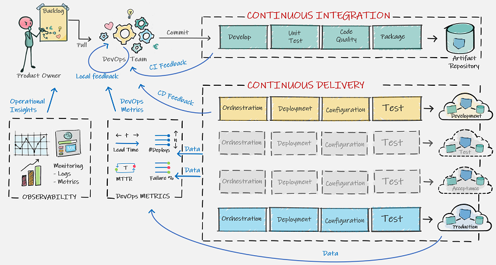
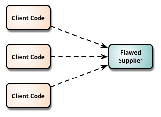

<!-- .element data-background-image="./images/trunk-in-forest.jpg" -->

## Trunk Based Development

&nbsp;

&nbsp;

&nbsp;

&nbsp;

&nbsp;

---

### But first ...

[..] Who the f... are you?

 <!-- .element height="75%" width="75%" -->

I am Zeger Hendrikse, nice to meet you too 😉

---

#### Warming up: first question

### What does CI mean?

<!-- .element class="fragment" -->
<b>A:</b> Continuous Improvement 
<b>B:</b> Continuous Integration 
<b>C:</b> Continuous Inspection 
<b>D:</b> Continuous Insights 

<!-- .element class="fragment" -->
A: Continuous Improvement 
B: Continuous Integration 
C: Continuous Inspection 
D: Continuous Insights 

---

### The

## Three

# Ways

---

### Amplify feedback loops

  
  
  
  
  

---

#### Warming up: second question

### What does CD mean?

<!-- .element class="fragment" -->
<b>A:</b> Continuous Delivery 
<b>B:</b> Continuous Development 
<b>C:</b> Continuous Deployment 
<b>D:</b> Continuous Design 

<!-- .element class="fragment" -->
A: Continuous Delivery 
B: Continuous Development 
C: Continuous Deployment 
D: Continuous Design 

---

## CI in the context of CD

  
  
  
  
  

---

#### First question: CI practice

#### Which of the following is **not** a CI best practice?

<!-- .element class="fragment" -->
<b>A:</b> Deploy the code to a test environment 
<b>B:</b> Keep the build fast 
<b>C:</b> Everyone commits to the baseline everyday 
<b>D:</b> When the build fails, everybody stops and helps to fix the build 

<!-- .element class="fragment" -->
A: Deploy the code to a test environment 
B: Keep the build fast 
C: Everyone commits to the baseline everyday 
D: When the build fails, everybody stops and helps to fix the build 

---

#### Second question: version control

##### What is the primary purpose of a VCS?

<!-- .element class="fragment" -->
<b>A:</b> To facilitate roll backs and roll forwards 
<b>B:</b> To facilitate seamless branching and merging 
<b>C:</b> To facilitate communication and collaboration 
<b>D:</b> To facilitate a central back-up of source code 

<!-- .element class="fragment" -->
A: To facilitate roll backs and roll forwards 
B: To facilitate seamless branching and merging 
C: To facilitate communication and collaboration 
D: To facilitate a central back-up of source code 

---

#### Do you practice Continuous Integration?

  
  
  

---

#### Third question: amplify feedback loops

##### Which is the odd one out?

<!-- .element class="fragment" -->
<b>A:</b> Integrate early and often 
<b>B:</b> Small batch size (containing changes) 
<b>C:</b> Pair-programming 
<b>D:</b> Pull requests 

<!-- .element class="fragment" -->
A: Integrate early and often 
B: Small batch size (containing changes) 
C: Pair-programming 
D: Pull requests 

---

### Which branching strategy should I choose?

---

### So right off the bat ...

---

### The Big Controversy

> [...] I get “Heretic, burn him at the stake” kind of feedback [...] &mdash; [Dave Farley](https://www.davefarley.net/?p=247)

---

### What do we usually see?

---

### The Death 

### of Continuous Integration

---

### Negative effects of branches

- <!-- .element class="fragment" --> Delays integration 
  - Slower feedback loops <!-- .element: class="fragment"-->
    - Kills continuous integration <!-- .element: class="fragment"-->

- <!-- .element: class="fragment"--> Increased change batch size 
  - Slower feedback loops <!-- .element: class="fragment"-->
    - Decreased deployment frequency <!-- .element: class="fragment"-->

- <!-- .element: class="fragment"--> Kills communication 
  - Headphone/hero developers!  <!-- .element: class="fragment"-->

---

> _The trunk-based development is all about communication. We use version_
  _control to communicate what we're doing to the rest of the team. To do it_
    _regularly enough, we have to work in very small batches._ [Jez Humble](https://github.com/rht-labs/enablement-docs/issues/123)

---

### State of DevOps report

---

### Trunk Based Development 

### Characteristics of TBD

- <!-- .element class="fragment" --> 
  **Small commits** (approx 10 - 15 lines) 
- <!-- .element class="fragment" --> 
  Commits (_self contained_ and _consistent_) include production and test code
- <!-- .element class="fragment" --> 
  Always commit and push together
- <!-- .element class="fragment" --> 
  **No** branches (except for spikes)
- <!-- .element class="fragment" --> 
  Code commits are reviewed ([early and synchronously](http://allankelly.blogspot.co.uk/2015/03/code-and-other-reviews-small-piece-of.html))

---

### TBD in action

---

##### More objections: the usual suspects...

> _At one extreme I get “Heretic, burn him at the stake” kind of feedback, at_
  _the other “Yes, but it can’t possibly work without Feature Branching – you must_
    _work in small teams and/or on trivially simple projects”._ &mdash; [Dave Farley](https://www.davefarley.net/?p=247)

---

# But ...

_I am (frequently) pulling from the mainline!_
<!-- .element class="fragment" -->

---

#### TDB: small and frequent commits

### Low-frequency integration

Suppose S1 and V1 contain a merge conflict...

---

#### TDB: small and frequent commits

### Low-frequency integration

... merge conflicts are late and big!

---

#### TDB: small and frequent commits

### High-frequency integration

Suppose S1 and V1 contain a merge conflict...

---

#### TBD: small and frequent commits

### High-frequency integration

... merge conflicts are small and early!

---

#### But how about (major) refactorings?

### Branching by abstraction, step 1

---

#### But how about (major) refactorings?

### Branching by abstraction, step 2

---

#### But how about (major) refactorings?

### Branching by abstraction, step 3

---

#### But how about (major) refactorings?

### Branching by abstraction, step 4

---

#### But how about (major) refactorings?

### Branching by abstraction, step 5

---

#### But how about unfinished changes?

  
  

---

#### But I have an immature team

### [Commit Early and Often](https://www.youtube.com/watch?v=Rep7vsUTaVI)

---

##### Summary

 <!-- .element width="80%" height="80%" -->

---

#### But regulators demand (proof of) four-eyes!

