<section data-background-image="./images/edward-howell-yl6xgqD3X14-unsplash.jpg">

## Trunk Based Development

&nbsp;

&nbsp;

&nbsp;

&nbsp;

&nbsp;

</section>

---

### But first ...

[..] Who the f... are you?

I am Zeger Hendrikse, nice to meet you too 😉

---

#### Warming up: first question

### What does CI mean?

* **A**: Continuous Improvement
* **B**: Continuous Integration
* **C**: Continuous Inspection
* **D**: Continuous Insights

---

#### Warming up: first question

### What does CI mean?

* **A**: Continuous Improvement
* **==&gt;B**: _Continuous Integration_ **&lt;==**
* **C**: Continuous Inspection
* **D**: Continuous Insights

---

### Context: three ways of DevOps

<!-- .element: class="fragment"-->

<!-- .element: class="fragment"-->

<!-- .element: class="fragment"-->

---

#### Warming up: second question

### What does CD mean?

* **A**: Continuous Delivery
* **B**: Continuous Development
* **C**: Continuous Deployment
* **D**: Continuous Design

---

#### Warming up: second question

### What does CD mean?

* **==&gt;A**: _Continuous Delivery_ **&lt;==**
* **B**: Continuous Development
* **==&gt;C**: _Continuous Deployment_ **&lt;==**
* **D**: Continuous Design

---

### CI in the context of CD

---

### CI in the context of CD

---

### CI in the context of CD

---

### CI in the context of CD

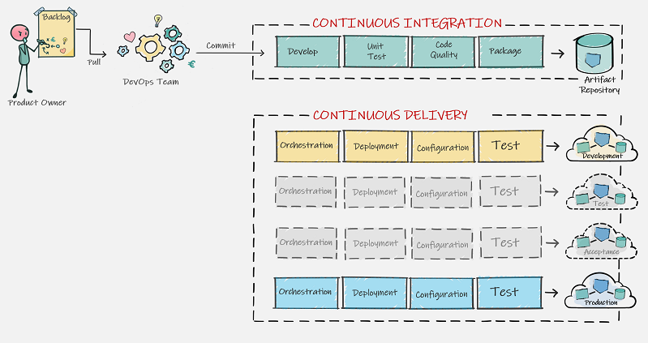

---

## CI in the context of CD

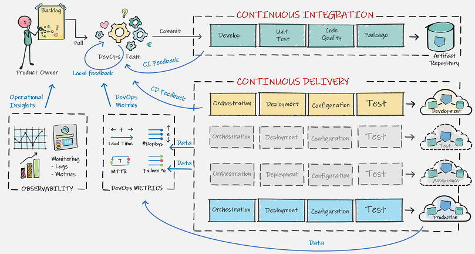

---

#### First question: CI practice

### Which of the following is **not** a CI best practice?

* **A**: Deploy the code to a test environment
* **B**: Keep the build fast
* **C**: Everyone commits to the baseline everyday
* **D**: When the build fails, everybody stops and helps to fix the build

---

#### First question: CI practice

### Which of the following is **not** a CI best practice?

* **==&gt;A**: Deploy the code to a _test environment_ **&lt;==**
* **B**: Keep the build fast
* **C**: Everyone commits to the baseline everyday
* **D**: When the build fails, everybody stops and helps to fix the build

---

#### Second question: version control

### What is the primary purpose of a VCS?

* **A**: To facilitate roll backs and roll forwards
* **B**: To facilitate seamless branching and merging
* **C**: To facilitate communication and collaboration
* **D**: To facilitate a central back-up of source code

---

#### Second question: version control

### What is the primary purpose of a VCS?

* **A**: To facilitate roll backs and roll forwards
* **B**: To facilitate seamless branching and merging
* **==&gt;C**: To facilitate communication and collaboration **&lt;==**
* **D**: To facilitate a central back-up of source code

---

#### Do you practice Continuous Integration?

---

#### Do you practice Continuous Integration?

[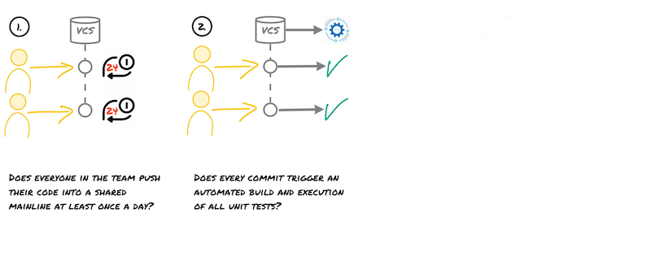](https://thinkinglabs.io/2020/03/23/continuous-integration-is-not-a-tooling-problem.html)

---

#### Do you practice Continuous Integration?

[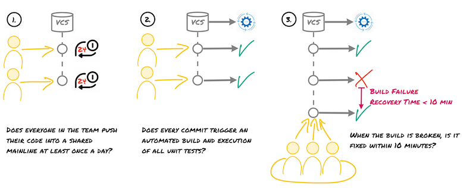](https://thinkinglabs.io/2020/03/23/continuous-integration-is-not-a-tooling-problem.html)

---

#### Third question: amplify feedback loops

### Which is the odd one out?

* **A** Integrate early and often
* **B** Small batch size (containing changes)
* **C** Pair programming
* **D** Pull requests

---

#### Third question: amplify feedback loops

### Which is the odd one out?

* **A** Integrate early and often
* **B** Small batch size (containing changes)
* **C** Pair programming
* **==&gt;D** Pull requests **&lt;==**

---

### Which branching strategy should I choose?

---

### So right off the bat ...

[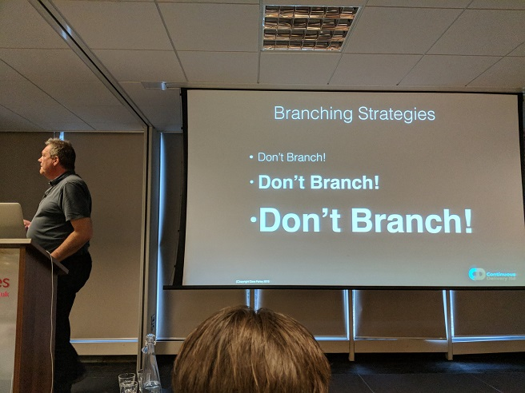](https://www.davefarley.net/?p=247)

---

### The Big Controversy

> [...] I get “Heretic, burn him at the stake” kind of feedback [...] &mdash; [Dave Farley](https://www.davefarley.net/?p=247)

---

### What do we usually see?

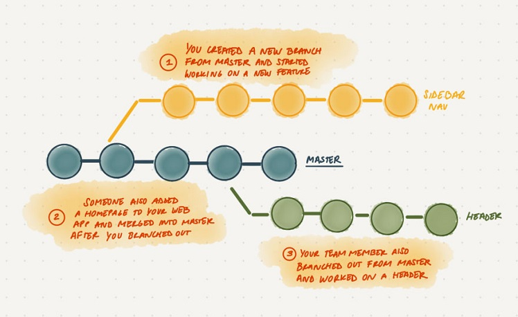

---

### The Death 

### of Continuous Integration

---

### Negative effects of branches

- Delays integration 
<!-- .element: class="fragment"-->
  - Slower feedback loops
<!-- .element: class="fragment"-->
  - Kills continuous integration
<!-- .element: class="fragment"-->

- Increased change batch size
<!-- .element: class="fragment"-->
  - Slower feedback loops
<!-- .element: class="fragment"-->
  - Decreased deployment frequency
<!-- .element: class="fragment"-->

- Kills communication 
<!-- .element: class="fragment"-->
  - Headphone/hero developers!
<!-- .element: class="fragment"-->

---

> _The trunk-based development is all about communication. We use version_
  _control to communicate what we're doing to the rest of the team. To do it_
  _regularly enough, we have to work in very small batches._ [Jez Humble](https://github.com/rht-labs/enablement-docs/issues/123)

---

### State of DevOps report

[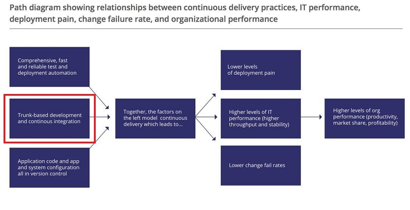](https://www.thoughtworks.com/insights/blog/enabling-trunk-based-development-deployment-pipelines)

---

### Trunk Based Development (TBD)

### Rules for TBD
- **Small commits** (approx 10 - 15 lines)
- Commits (_self contained_ and _consistent_) include production and test code
- Always commit and push together
- **No** branches (except for spikes)
- Code commits are reviewed ([early and synchronously](http://allankelly.blogspot.co.uk/2015/03/code-and-other-reviews-small-piece-of.html))

---

### TBD in action

---

### More objections! The usual suspects...

> _At one extreme I get “Heretic, burn him at the stake” kind of feedback, at_
  _the other “Yes, but it can’t possibly work without Feature Branching – you must_
  _work in small teams and/or on trivially simple projects”._ &mdash; [Dave Farley](https://www.davefarley.net/?p=247)

---

### I am (frequently) pulling from the mainline!

---

### TDB: small and frequent commits

### Low-frequency integration

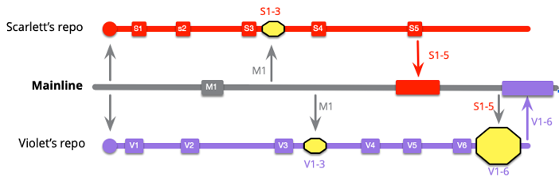

Suppose S1 and V1 contain a merge conflict...

---

### TDB: small and frequent commits

### Low-frequency integration

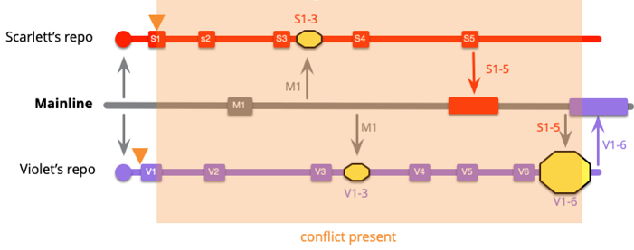

... merge conflicts are late and big!

---

### TDB: small and frequent commits

### High-frequency integration

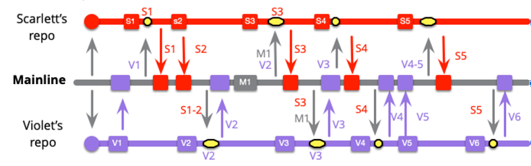

Suppose S1 and V1 contain a merge conflict...

---

### TBD: small and frequent commits

### High-frequency integration

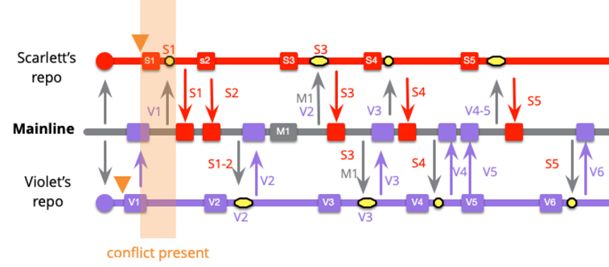

... merge conflicts are small and early!

---

### But how about (major) refactorings?

### Branching by abstraction, step 1

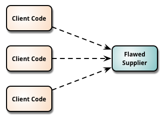

---

### But how about (major) refactorings?

### Branching by abstraction, step 2

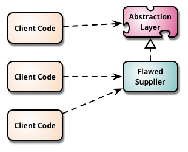

---

### But how about (major) refactorings?

### Branching by abstraction, step 3

---

### But how about (major) refactorings?

### Branching by abstraction, step 4

---

### But how about (major) refactorings?

### Branching by abstraction, step 5

---

### But how about unfinished changes?

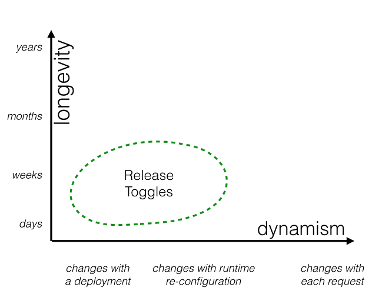

---

### But how about unfinished changes?

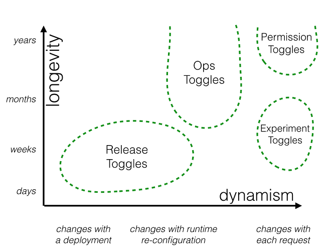

---

### But I have an immature team

## [Commit Early and Often](https://www.youtube.com/watch?v=Rep7vsUTaVI)

---

### But regulators demand (proof of) four-eyes!

See also [the TBD section](https://confluence.aws.abnamro.org/display/GRIDAD/Four-eyes+principle)
on the [software development pages](https://confluence.aws.abnamro.org/display/GRIDAD/Software+Development) 
