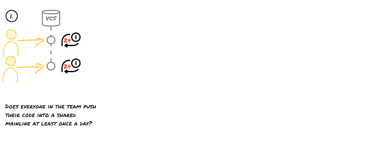
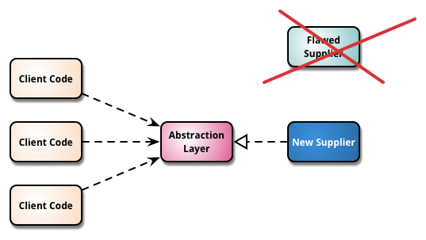

<section data-background-image="./images/edward-howell-yl6xgqD3X14-unsplash.jpg">

## Trunk Based Development

&nbsp;

&nbsp;

&nbsp;

&nbsp;

&nbsp;

</section>

---

Zeger Hendrikse

DevOps coach

---

### Warming up: first question

#### What does CI mean?

* **A**: Continuous Improvement
* **B**: Continuous Integration &#10004;<!-- .element: class="fragment"-->
* **C**: Continuous Inspection
* **D**: Continuous Insights

---

### Context: three ways of DevOps

<!-- .element: class="fragment"-->

<!-- .element: class="fragment"-->

<!-- .element: class="fragment"-->

---

### Warming up: second question

#### What does CD mean?

* **A**: Continuous Delivery &#10004;<!-- .element: class="fragment"-->
* **B**: Continuous Development
* **A**: Continuous Deployment &#10004;<!-- .element: class="fragment"-->
* **D**: Continuous Design

---

### CI in the context of CD

  
  
  
  
  

---

### First question: CI practice

#### What is **not** a CI best practice?

* **A**: Deploy & test the code to a test environment &#10004;<!-- .element: class="fragment"-->
* **B**: Keep the build fast
* **C**: Everyone commits to the baseline everyday
* **D**: When the build fails, everybody stops to fix it

---

### Second question: version control

#### What is the primary purpose of a VCS?

* **A**: Facilitate roll backs and roll forwards
* **B**: Facilitate seamless branching and merging
* **C**: Facilitate communication and collaboration &#10004;<!-- .element: class="fragment"-->
* **D**: Facilitate a central back-up of source code

---

#### Do you practice Continuous Integration?

  
  
  

---

### Third question: amplify feedback loops

#### Which is the odd one out?

* **A** Integrate early and often
* **B** Small batch size (containing changes)
* **C** Pair programming
* **D** Pull requests &#10004;<!-- .element: class="fragment"-->

---

### Which branching strategy should I choose?

---

### So right off the bat ...

---

### The Big Controversy

> [...] I get “Heretic, burn him at the stake” kind of feedback [...] &mdash; [Dave Farley](https://www.davefarley.net/?p=247)

---

### What do we usually see?

---

### The Death 

### of Continuous Integration

---

### Negative effects of branches

- <!-- .element: class="fragment"-->
  Delays integration 
  <!-- .element: class="fragment"-->
  - Slower feedback loops
  <!-- .element: class="fragment"-->
  - Kills continuous integration
  <!-- .element: class="fragment"-->

- <!-- .element: class="fragment"-->
  Increased change batch size
  <!-- .element: class="fragment"-->
  - Slower feedback loops
  <!-- .element: class="fragment"-->
  - Decreased deployment frequency
  <!-- .element: class="fragment"-->

- <!-- .element: class="fragment"-->
  Kills communication 
  <!-- .element: class="fragment"-->
  - Headphone/hero developers!
  <!-- .element: class="fragment"-->

---

> _The trunk-based development is all about communication. We use version_
  _control to communicate what we're doing to the rest of the team. To do it_
  _regularly enough, we have to work in very small batches._ [Jez Humble](https://github.com/rht-labs/enablement-docs/issues/123)

---

### State of DevOps report

---

### Trunk Based Development (TBD)

- <!-- .element: class="fragment"-->
  **Small commits** (approx 10 - 15 lines)
- <!-- .element: class="fragment"-->
  Commits (_self contained_ and _consistent_) include production and test code
- <!-- .element: class="fragment"-->
  Always commit and push together
- <!-- .element: class="fragment"-->
  **No** branches (except for spikes)
- <!-- .element: class="fragment"-->
  Review [early and synchronously](http://allankelly.blogspot.co.uk/2015/03/code-and-other-reviews-small-piece-of.html)

---

### TBD in action

---

#### More objections: the usual suspects...

> _At one extreme I get “Heretic, burn him at the stake” kind of feedback, at_
  _the other “Yes, but it can’t possibly work without Feature Branching – you must_
  _work in small teams and/or on trivially simple projects”._ &mdash; [Dave Farley](https://www.davefarley.net/?p=247)

---

### I am (frequently) pulling from the mainline!

---

### TDB: small and frequent commits

#### Low-frequency integration

Suppose S1 and V1 contain a merge conflict...

---

### TDB: small and frequent commits

#### Low-frequency integration

... merge conflicts are late and big!

---

### TDB: small and frequent commits

#### High-frequency integration

Suppose S1 and V1 contain a merge conflict...

---

### TBD: small and frequent commits

#### High-frequency integration

... merge conflicts are small and early!

---

#### But how about (major) refactorings?

##### Branching by abstraction, step 1

---

#### But how about (major) refactorings?

##### Branching by abstraction, step 2

---

#### But how about (major) refactorings?

##### Branching by abstraction, step 3

---

#### But how about (major) refactorings?

##### Branching by abstraction, step 4

---

#### But how about (major) refactorings?

##### Branching by abstraction, step 5

---

#### But how about unfinished changes?

---

#### But how about unfinished changes?

---

#### But I have an immature team

#### [Commit Early and Often](https://www.youtube.com/watch?v=Rep7vsUTaVI)
<!-- .element: class="fragment"-->

---

#### But regulators demand (proof of) four-eyes!

