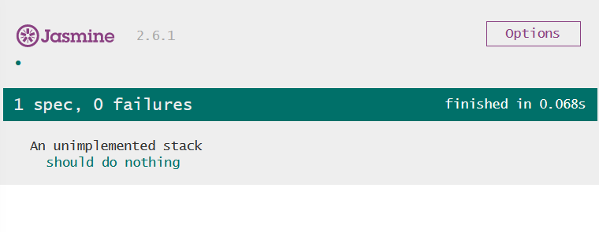

## Implementing a stack 

#### in Javascript with Jasmine

([using replit.com](https://replit.com/@zwh/Stack-with-TDD-Javascript-and-Jasmine#README.md),
freely modified by Zeger Hendrikse from 
[Uncle Bob's lesson 4](https://www.youtube.com/watch?v=58jGpV2Cg50))

---

### Sneak preview

<iframe width="100%" height="300" src="//jsfiddle.net/zhendrikse/gd60mfc7/4/embedded/js,css,result/dark/" allowfullscreen="allowfullscreen" allowpaymentrequest frameborder="0"></iframe>

---

### Let's build in replit.com

<iframe frameborder="0" width="100%" height="500px" src="https://replit.com/@zwh/Stack-with-TDD-Javascript-and-Jasmine?lite=false"></iframe>

---

### First verify we can write a test

```javascript
describe("An unimplemented stack", function () {
  it("should do nothing", function () {
      expect(true).toEqual(true);
  })
})
```
----

Which results in:



---

### An empty stack should be... empty?

```javascript
describe("A new stack", function () {
  it("should be empty", function () {
    var myStack = new Stack()
    expect(myStack.isEmpty()).toEqual(true);
  })
})
```
----
```javascript 
class Stack {
  isEmpty() {
    return true
  }
}
``` 
---

### Our updated plan

- ~~Start with an empty stack~~ &#10003;
- Define pop on an empty stack
- Define push on an empty stack
- Define pop on a non-empty stack
- Define multiple pushes and pops

---
### Pop on an empty stack

```javascript
...
  it("should throw an exception on a pop operation", function() {
    var myStack = new Stack()
    expect( function(){ myStack.pop() } )
      .toThrow(new Error("Stack underflow"));
  })
...
```
----

```javascript
class Stack {
  ...
  pop() {
    throw new Error("Stack underflow")
  }
}
```

---
### Red, green, ... refactor (DRY)!


```javascript
describe("A new stack", function () {
  var myStack;

  beforeEach(function() {
      myStack = new Stack()
  })

  it("should be empty", function () {
    expect(myStack.isEmpty()).toEqual(true);
  })

  it("should throw an exception on a pop operation", function() {
    expect( function(){ myStack.pop() } )
      .toThrow(new Error("Stack underflow"));
  })
})
```

---

### Our updated plan

- ~~Start with an empty stack~~ &#10003;
- ~~Define pop on an empty stack~~ &#10003;
- Define push on an empty stack
- Define pop on a non-empty stack
- Define multiple pushes and pops

---
### Push something onto the stack

```javascript
...
  it("should not be empty after a push operation", function() {
    myStack.push(8)
    expect(myStack.isEmpty()).toEqual(false);
  })
...
```
----

```javascript
class Stack {
  constructor() {
    this.stackIsEmtpy = true
  }

  isEmpty() {
    return this.stackIsEmtpy
  }

  push(newElement) {
    this.stackIsEmtpy = false
  }
  ...
```

---
### ... and pop it from the stack

```javascript
  it("should be empty after one push and one pop", function() {
    myStack.push(8)
    myStack.pop()
    expect(myStack.isEmpty()).toEqual(true);
  })
```
----

```javascript
class Stack {
  ...

  pop() {
    if (this.stackIsEmtpy)
      throw new Error("Stack underflow")
    this.stackIsEmtpy = true
  }
  ...
```

---
### DRY revisited

```javascript
describe("A new stack", function () {
  var myStack;

  beforeEach(function () {
    myStack = new Stack()
  })

  ...

  describe("which had one push", function () {
    beforeEach(function () {
      myStack.push(8)
    })
    it("should not be empty", function () {
      expect(myStack.isEmpty()).toEqual(false);
    })
    it("should be empty after one pop", function () {
      myStack.pop()
      expect(myStack.isEmpty()).toEqual(true);
    })
  })
})
```

---

### Our updated plan

- ~~Start with an empty stack~~ &#10003;
- ~~Define pop on an empty stack~~ &#10003;
- ~~Define push on an empty stack~~ &#10003;
- Define pop on a non-empty stack
- Define multiple pushes and pops


---
### Two pushes and one pop!?

```javascript
  ...
  it("should not be empty after 2 pushes and 1 pop", function() {
    myStack.push(8)
    myStack.push(9)
    myStack.pop()
    expect(myStack.isEmpty()).toEqual(false);
  })
  ...
```

----
### Introduction of size inevitable!

```javascript
class Stack {
  constructor() {
    this.stackIsEmtpy = true
    this.size = 0
  }

  isEmpty() {
    return this.size == 0
  }

  pop() {
    if (this.stackIsEmtpy)
      throw new Error("Stack underflow")
    this.stackIsEmtpy = true
    --this.size
  }

  push(newElement) {
    this.stackIsEmtpy = false
    this.size++
  }
}
```

---

### Red, green, ... refactor!

```javascript
class Stack {
  constructor() {
    this.size = 0
  }

  isEmpty() {
    return this.size == 0
  }

  pop() {
    if (this.isEmpty())
      throw new Error("Stack underflow")
    --this.size
  }

  push(newElement) {
    this.size++
  }
}
```

---
### Does the pop actually work?

```javascript
...
    it("should pop the pushed element", function () {
      expect(myStack.pop()).toEqual(8)
    })
....
```
----

```javascript
...
  pop() {
    if (this.isEmpty())
      throw new Error("Stack underflow")
    --this.size
    return 8
  }
...
```

---

### Our updated plan

- ~~Start with an empty stack~~ &#10003;
- ~~Define pop on an empty stack~~ &#10003;
- ~~Define push on an empty stack~~ &#10003;
- ~~Define pop on a non-empty stack~~ &#10003;
- Define multiple pushes and pops

---
### Let's extend the test

```javascript
...
    it("should pop the pushed element", function () {
      expect(myStack.pop()).toEqual(8)
      myStack.push(9)
      expect(myStack.pop()).toEqual(9)
    })
....
```

----

```javascript
class Stack {
  constructor() {
    this.size = 0
    this.element = -1
  }

  isEmpty() { return this.size == 0 }

  pop() {
    if (this.isEmpty())
      throw new Error("Stack underflow")
    --this.size
    return this.element;
  }

  push(newElement) {
    this.size++
    this.element = newElement
  }
}
```

---

### Multiple push and pop

```javascript
    it("should pop 2 elements after another push", function() {
      myStack.push(9)
      expect(myStack.pop()).toEqual(9)
      expect(myStack.pop()).toEqual(8)
    })
```
----

```javascript
class Stack {
  constructor() {
    this.size = 0
    this.element = []
  }

  isEmpty() { return this.size == 0 }

  pop() {
    if (this.isEmpty())
      throw new Error("Stack underflow")
    
    return this.element[--this.size];
  }

  push(newElement) {
    this.element[this.size++] = newElement
  }
}
```

---

### Our updated plan

- ~~Start with an empty stack~~ &#10003;
- ~~Define pop on an empty stack~~ &#10003;
- ~~Define push on an empty stack~~ &#10003;
- ~~Define pop on a non-empty stack~~ &#10003;
- ~~Define multiple pushes and pops~~ &#10003;
