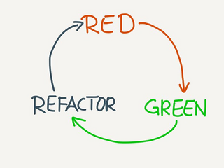
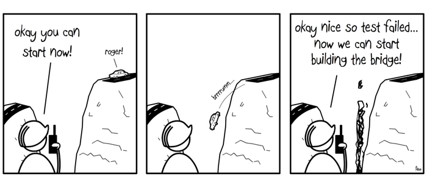

## Coders should test

### Testers should code

by [Zeger Hendrikse](https://www.it-essence.nl/)

---
### Goals

<ul>

<li>Coding + testing are two sides of the same coin </li>

<li>Live demo of (an introduction to) TDD</li>

 

<li>Why you should start practising TDD today!</li>

 
</ul>

---

### Rulez during this session

<ul>

<li>Questions are allowed at all times</li>

<li>
The goal is to illustrate <i>the TDD process</i>
  <ul>
  <li>The goal is _not_ to write the best
    <ul>
    <li>Javascript ever</li>
    <li>Python ever</li>
    <li>...</li>
    </ul>
   </li>
   <li>User story is not the most realistic either</li>
</li>

---

### Rulez of the TDD game

<table>
  <tbody><tr>
    <td>
      <ol>
        <li>Write a failing test</li>
        <li>Make it pass</li>
        <li>Refactor relentlessly</li>
      </ol>
    </td>
    <td>
      
    </td>
  </tr>
</table>

---

### Kent Beck's [design rules](https://martinfowler.com/bliki/BeckDesignRules.html)

1. Passes the tests
2. Reveals intention
3. No duplication ([DRY](https://en.wikipedia.org/wiki/Don%27t_repeat_yourself))
4. Fewest elements (simplest thing that could possibly work)

---

### Who is doing what

<ul>

<li>Do you write unit test afterwards</li>

<li>Do you write unit test beforehand</li>

<li>Do you do TDD</li>

</ul>

---

### TDD is not building a bridge nor house!

---

### User story

<b>As</b> a worker in a restaurant 

<b>I want</b> to place my plates on a stack 

<b>so that</b> I always have clean plates available to serve dishes

---

### Let's create a plan

- Start with an empty stack
- Define pop on an empty stack
- Define push on an empty stack
- Define pop on a non-empty stack
- Define multiple pushes and pops

&nbsp;

Credits to Kent Beck!

---

### Let's do this

- Let's do this [in Javascript](./javascript/slides.md)!
- Let's do this [in Python](./python/index.html)!
- Let's do this [in Typescript](./typescript/index.html)!
- Let's do this in Java
- Let's do this in C#
- Let's do this in C++

---

### Retrospective

<ul>

<li>Tests become more <i>specific</i>, code more <i>generic</i></li>

<li><a href="../ci-tbd/index.html">TBD</a> is a no-brainer</li>

<li>Difficulty is postponing "the gold"</li>

<li>Contravariant test suites</li>

<li>1, 2, N</li>

<li>Tests grouped according to shared set-up</li>

<li>What is still left to test?</li>

</ul>

---

### It's only the beginning...

<ul>

<li><a href="https://martinfowler.com/articles/mocksArentStubs.html">Mocks, stubs, fakes, spies, ...</a></li>

<li><a href="https://khalilstemmler.com/articles/software-design-architecture/organizing-app-logic/">The Clean Architecture</a>: how to cope with dependencies on external systems</li>

<li><a href="https://blog.devgenius.io/detroit-and-london-schools-of-test-driven-development-3d2f8dca71e5">London school / Detroit schools</a></li>

<li>Developer tests his own code: <a href="../four-eyes/index.html">the nightmare of every auditor!</a></li>

</ul>
