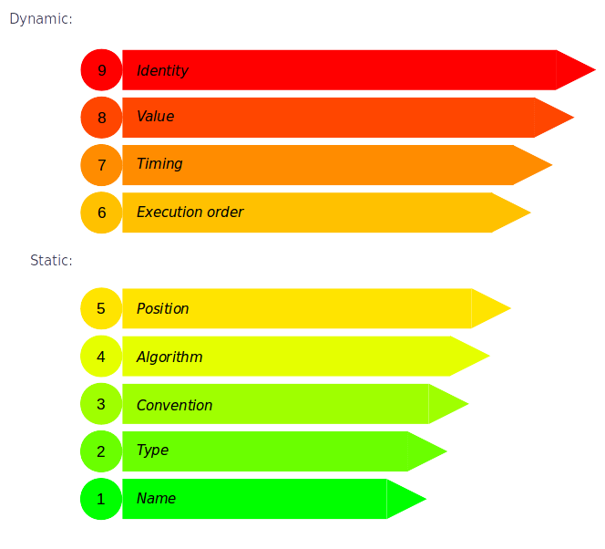

### Coupling

## Cohesion

# Connascence

by [Zeger Hendrikse](https://www.it-essence.nl/)

---

- Why would you want to learn about this?
<!-- .element: class="fragment"-->
- ...
<!-- .element: class="fragment"-->
- ...
<!-- .element: class="fragment"-->

---

### [Connascence](https://connascence.io/) &mdash; definition

- The common birth of two or more at the same time; the production of two or more together
- That which is born or produced with another
- The act of growing together

---

<section data-background-image="./images/aldebaran-s-O-6kqnEvO1s-unsplash.jpg">

# Connascence

&nbsp;

&nbsp;

&nbsp;

&nbsp;

&nbsp;

## [The GUT of Software Design](https://www.youtube.com/watch?v=NLT7Qcn_PmI)

</section>
---

### Connascence

> In software engineering, two components are connascent if a change in one would require the other to be modified in torde to maintain the overall correctness of the system &mdash; [Wikipedia](https://en.wikipedia.org/wiki/Connascence)

---

### But why?

---

### But why?

- A guide to choose the most effective refactorings
<!-- .element: class="fragment"-->
- Objective tool than code smells to identify technical debt 
<!-- .element: class="fragment"-->
- Identify design probems &mdash; coupling / cohesion
<!-- .element: class="fragment"-->

---

### Connascence

--- 

### Connascence of Name

> occurs whenever two components must agree on the same name.

---

### Connascence of position

> occurs whenever two components must be adjacent or appear in a particular order.

---

### Connascence of Meaning

> occurs whenever two components must agree on the interpretation of data values.

---

### Control Coupling

> occurs when one component passes a piece of information that is intended to control the internal logic of the other.

---

### Connascence of Algorithm

> occurs whenever two omponents must agree on a particular algorithm.

---

### Connascence of Type

> occurs whenever two components must agree on the same type.

---

### Connascence of Value

> occurs when the values of two components are related.

---

### Connascence of Timing

> occurs when the timing of execution is important.

---

### Connascence of Execution

> occurs when the _order_ of execution of two components is important

---

### Connascence of Identity

> occurs when two components must reference the same object.

---

### Conclusion

> Your codebase will always be connascent.

> It just depends on whether you as a developer are aware of what kind of connascence is present. Development is about making conscious decisions on whether it is worth the effort of refactoring &mdash; [making sense of connascence](https://thinktomorrow.be/blog/making-sense-of-connascence)

