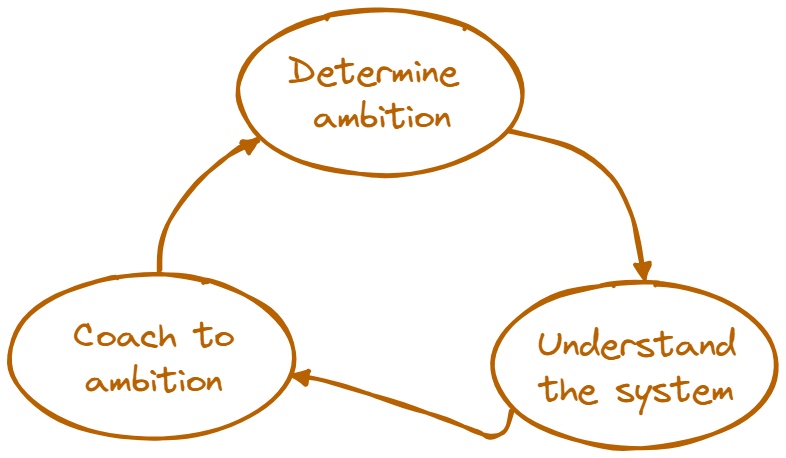

## DevOps 

# diagnostics

#### Zeger Hendrikse &amp; Rob Westgeest

---

##### DevOps coaching is

---

### DevOps introduction

Introduction of the

- Three ways <!-- .element class="fragment" -->
- DevOps capabilities <!-- .element class="fragment" -->
- DORA metrics <!-- .element class="fragment" -->
- Toyota improvement kata <!-- .element class="fragment" -->

---

### Questionnaire

Send [Questionnaire PDF](./html/questionnaire.html) to participants 
  - To be filled in _before_ session
  - To be filled in _individually_

----

### Questionnaire

<iframe data-src="./html/questionnaire.html" width="100%" height="500px"></iframe>

---

### Collection of results

Collect questions related to

- flow on [this form](./html/flow.html)
- feedback on [this form](./html/feedback.html)
- learning &amp; experimentation on [this form](./html/learning_experimentation.html)

----

### Flow

<iframe data-src="./html/flow.html" width="100%" height="600px"></iframe>

----

### Feedback

<iframe data-src="./html/feedback.html" width="100%" height="600px"></iframe>

----

### Learning &amp; Experimentation

<iframe data-src="./html/learning_experimentation.html" width="100%" height="600px"></iframe>
