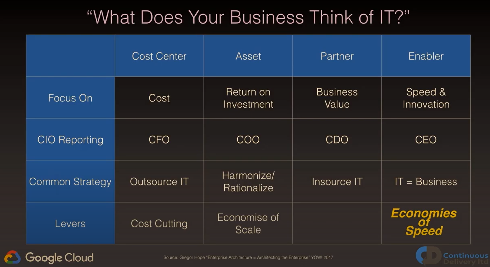
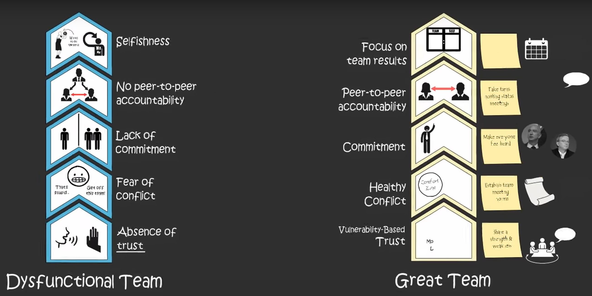
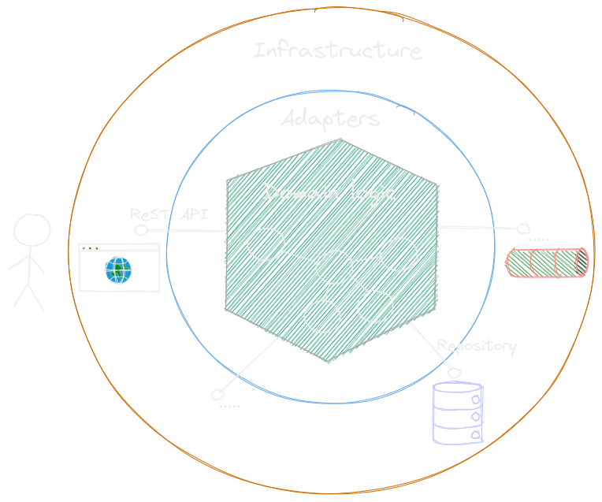
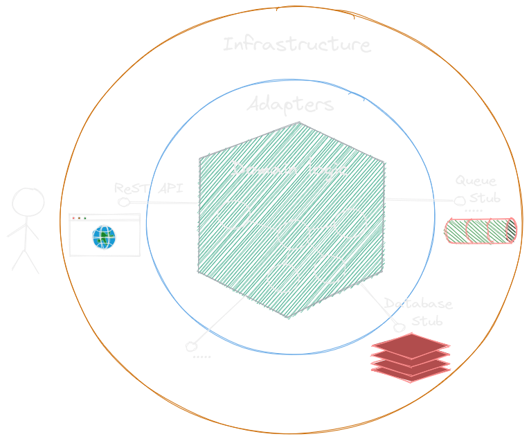
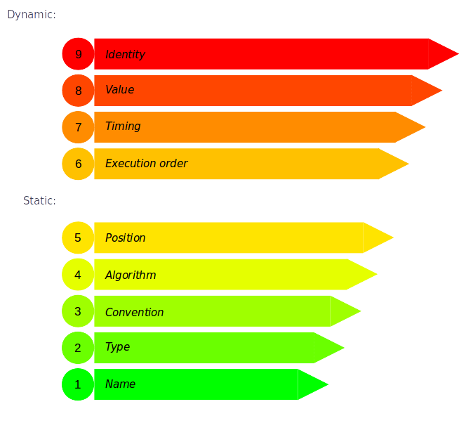

<section data-background-image="./images/todd-desantis-RBa31iRYbfg-unsplash.jpg">

### Wouldn't it be great...

&nbsp;

&nbsp;

&nbsp;

&nbsp;

&nbsp;

&nbsp;

&nbsp;

&nbsp;

</section>
---

#### If IT would be seen as enabler?

---

#### If we could build a culture of trust

(From the [The five dysfunctions of a team](https://www.amazon.com/Five-Dysfunctions-Team-Leadership-Fable/dp/0787960756))
<!-- .element: class="fragment"-->

---

#### If we could execute our specifications?

<iframe frameborder="0" width="100%" height="500px" src="https://replit.com/@zwh/Stack-with-TDD-Javascript-and-Jasmine?lite=false"></iframe>

---

### [Dave Farley](https://www.youtube.com/watch?v=Bq_oz7nCNUA) &#8212; the culture of TDD

---

#### If we could achieve test contra-variance?

---

#### If we could confidently touch legacy code?

<iframe frameborder="0" width="100%" height="500px" src="https://replit.com/@zwh/ApprovalTestDemo-1?lite=false"></iframe>

---

##### If we could employ a hexagonal architecture?

---

##### So that we can test everything locally?

---

#### By applying dependency inversion

<iframe frameborder="0" width="100%" height="500px" src="https://replit.com/@zwh/DatabaseAdapterPattern?lite=false"></iframe>

---

##### If we could objectively measure coupling?

