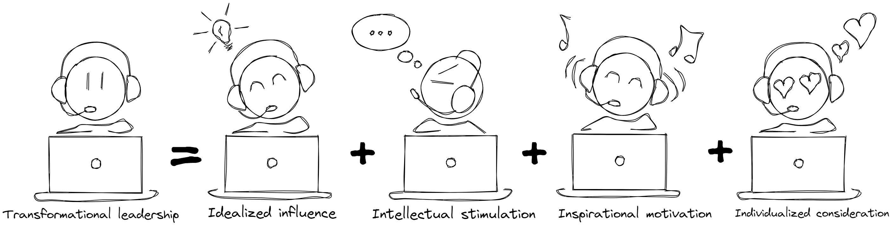
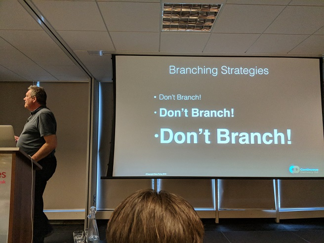

<section data-background-image="./images/todd-desantis-RBa31iRYbfg-unsplash.jpg">

#### I have a dream that one day...

&nbsp;

&nbsp;

&nbsp;

&nbsp;

</section>
---

#### IT will be seen as enabler

---

#### And we can build upon a culture of trust

(From the [The five dysfunctions of a team](https://www.amazon.com/Five-Dysfunctions-Team-Leadership-Fable/dp/0787960756))
<!-- .element: class="fragment"-->

---

#### Facilitated by transformational leadership

&nbsp;

&nbsp;

---

<section data-background-image="./images/todd-desantis-RBa31iRYbfg-unsplash.jpg">

### I have a dream...

&nbsp;

&nbsp;

&nbsp;

&nbsp;

</section>

---

### That testers and developers

### are one
<!-- .element: class="fragment"-->

---

#### To create executable specifications

<iframe frameborder="0" width="100%" height="500px" src="https://replit.com/@zwh/Stack-with-TDD-Javascript-and-Jasmine?lite=false"></iframe>

---

#### By applying TDD rigorously

[Dave Farley](https://www.youtube.com/watch?v=Bq_oz7nCNUA) &#8212; the culture of TDD
<!-- .element: class="fragment"-->

---

<section data-background-image="./images/todd-desantis-RBa31iRYbfg-unsplash.jpg">

### I have a dream...

&nbsp;

&nbsp;

&nbsp;

&nbsp;

</section>

---

#### We can achieve test contra-variance

Not this mess!
<!-- .element: class="fragment"-->

---

#### We can confidently refactor legacy code

<iframe frameborder="0" width="100%" height="500px" src="https://replit.com/@zwh/GildedRosePython?lite=false"></iframe>

(Note the f...ing code coverage 😝)
<!-- .element: class="fragment"-->

---

##### According to objective coupling metrics

---

<section data-background-image="./images/todd-desantis-RBa31iRYbfg-unsplash.jpg">

### I have a dream that one day...

&nbsp;

&nbsp;

&nbsp;

&nbsp;

</section>

---

##### We all employ a hexagonal architecture

---

##### So that we can test everything locally

---

#### By applying dependency inversion

<iframe frameborder="0" width="100%" height="500px" src="https://replit.com/@zwh/DatabaseAdapterPattern?lite=false"></iframe>

---

<section data-background-image="./images/todd-desantis-RBa31iRYbfg-unsplash.jpg">

### I have a dream...

&nbsp;

&nbsp;

&nbsp;

&nbsp;

</section>

---

#### To continuously integrate ...

---

#### ... Small changes frequently

---

<section data-background-image="./images/todd-desantis-RBa31iRYbfg-unsplash.jpg">

### I have a dream...

&nbsp;

&nbsp;

&nbsp;

&nbsp;

</section>

---

##### To be continuously compliant by practicing CD

> Over time I hope, and expect, regulation to adapt, to catch-up to these more effective ways of working. 
  It is, after all, a better way to fulfil the underlying intent of any regulatory mechanism for software 
  &mdash; [Dave Farley](https://www.davefarley.net/?p=285)

