###### A systemic case for DevOps

  
  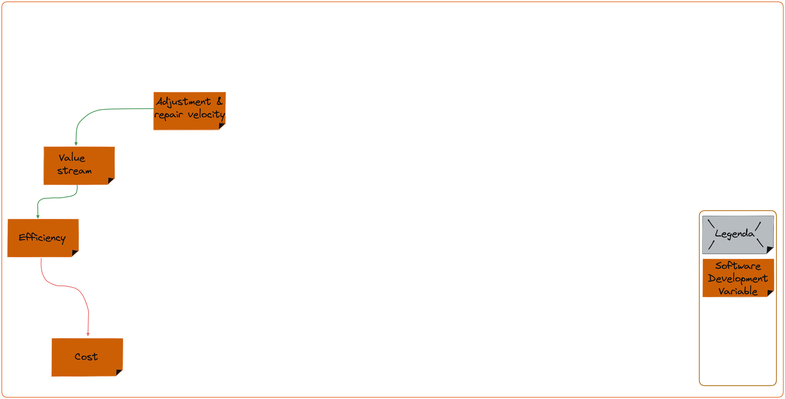
  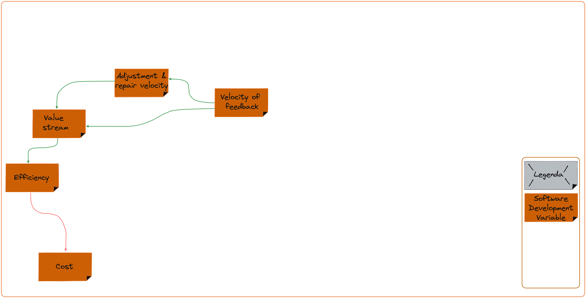
  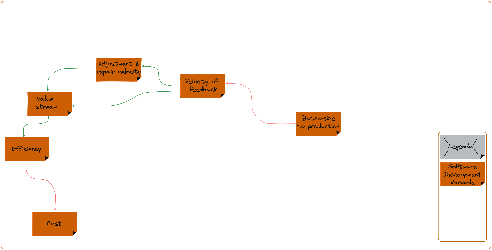
  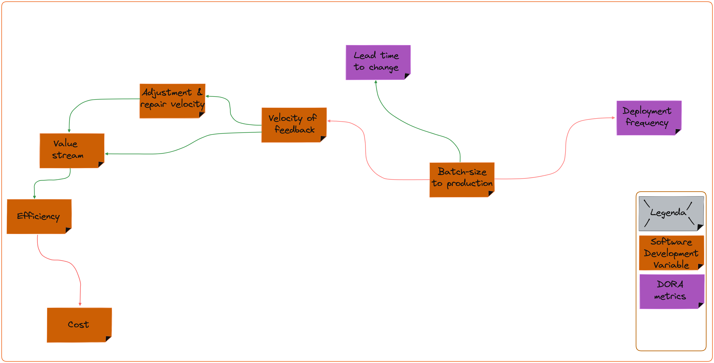
  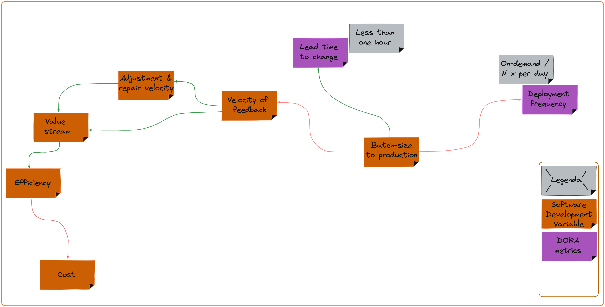
  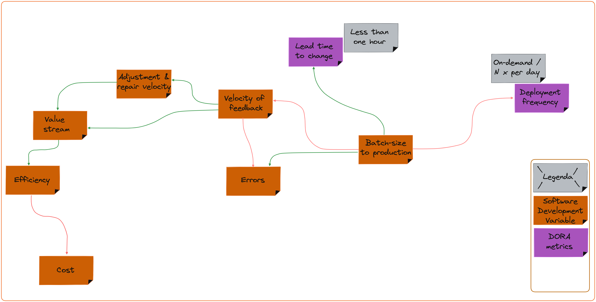
  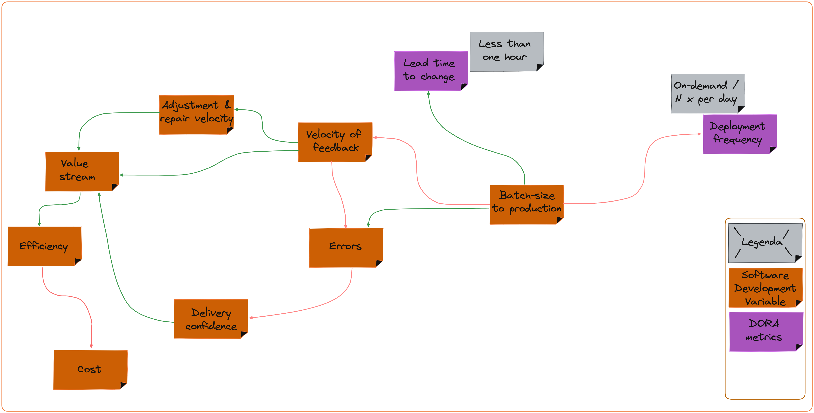
  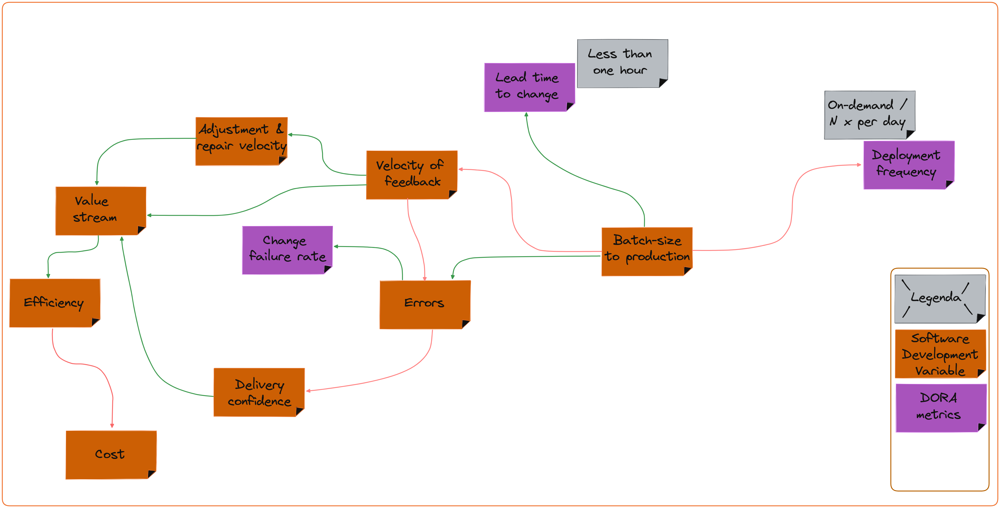
  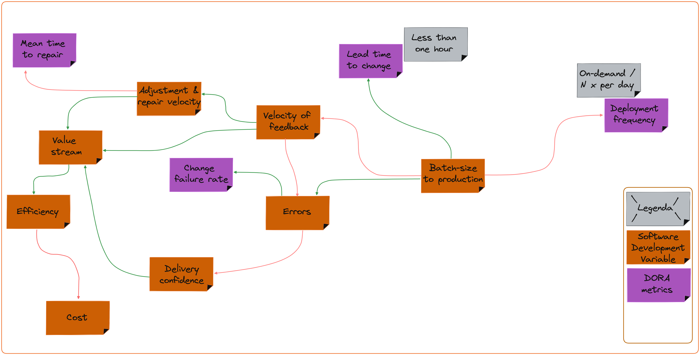
  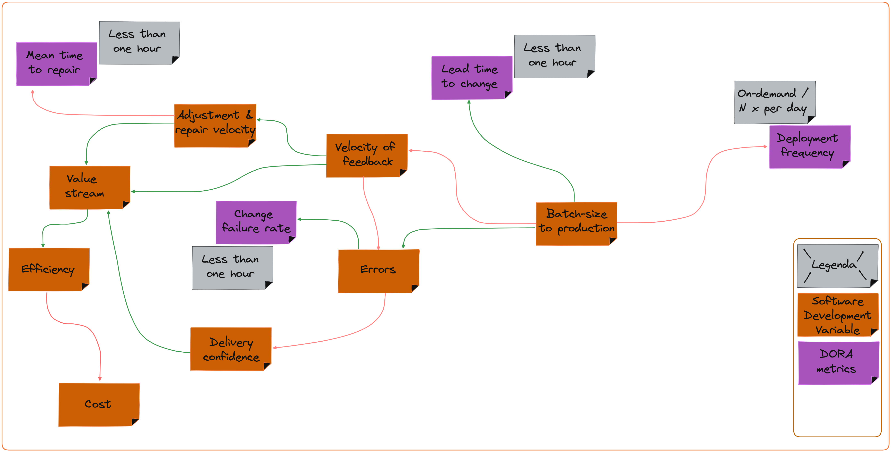
  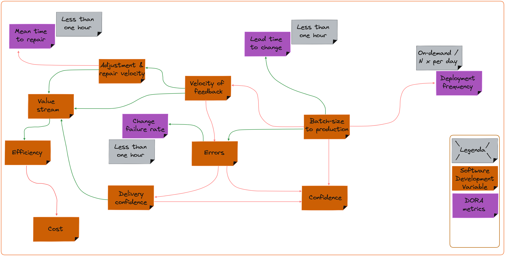
  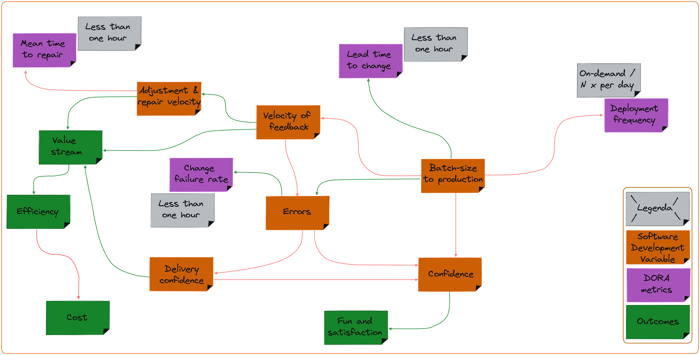
  
  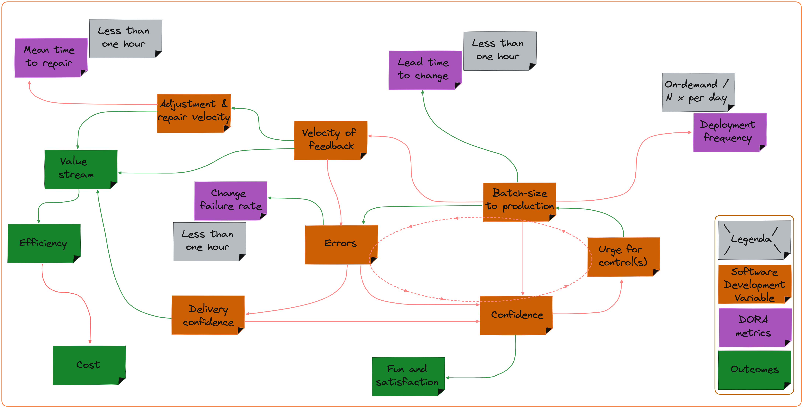
  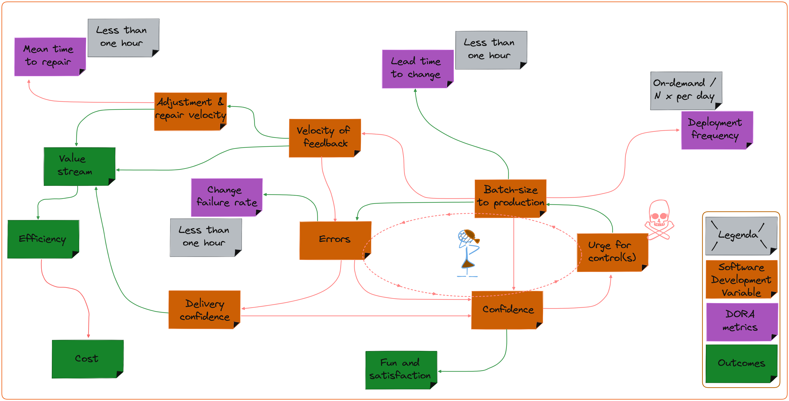
  

---

##### DevOps is

> A combination of **culture and set of skills** 
> to bring **small changes** to production
> **fast and frequently** 
> 
> in order to retrieve **feedback from production** 
> to **continuously improve** (both in way-of-working and product)

---

##### DevOps coaching is

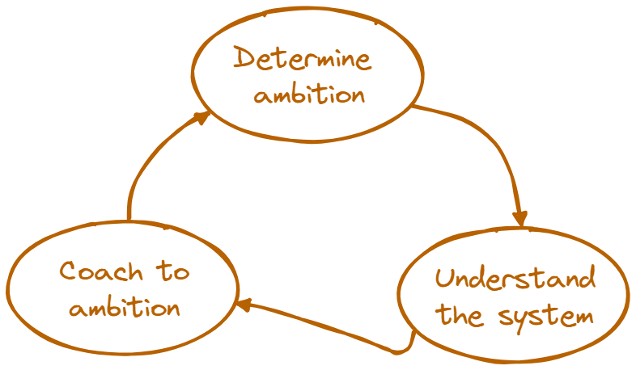

