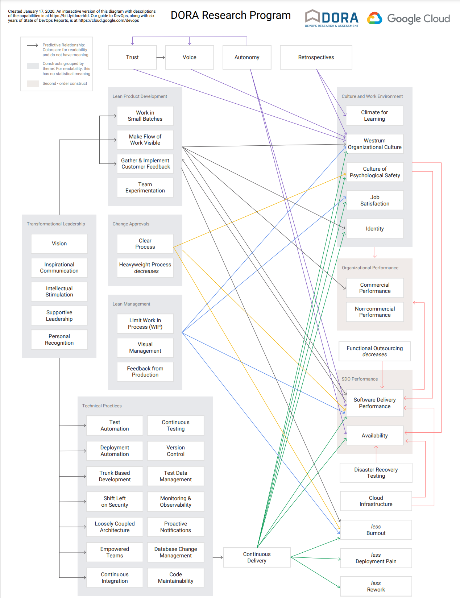
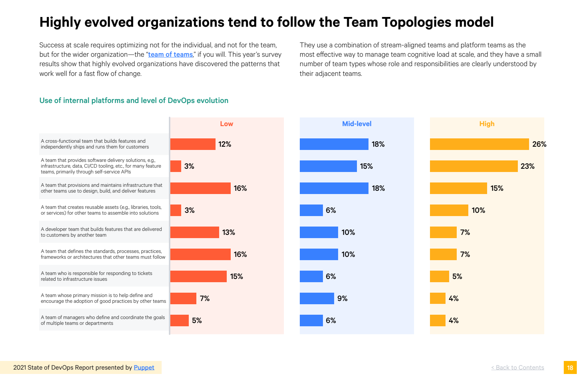

### Software Delivery Process
### Measuring Performance

#### DORA metrics

by [Zeger Hendrikse](https://www.it-essence.nl/)

credits: Remko Seelig

---

### Agenda

- <!-- .element: class="fragment" --> Motivation

- <!-- .element: class="fragment" --> Problematic metrics

- <!-- .element: class="fragment" --> Proper metrics

- <!-- .element: class="fragment" --> DORA
  - Relation to software delivery performance
  - DORA metrics

---

### Motivation: situation sketches

1. <!-- .element: class="fragment" --> Is my (expensive) coach effective?

2. <!-- .element: class="fragment" --> Happy customer + end-to-end resp. &rarr; burn-out?

3. <!-- .element: class="fragment" --> Swift updates while maintaining stability?

---

#### Problematic metrics: local optimizations

What happens if you measure

- <!-- .element: class="fragment" --> Measure number of new features &#8594; ...
  - <!-- .element: class="fragment" --> ops engineers get flooded.

- <!-- .element: class="fragment" --> Measure the stability of the system &#8594; ...
  - <!-- .element: class="fragment" --> ops creating rigid change processes.

Local optimizations lead to conflicting concerns!
<!-- .element: class="fragment" -->

---

#### Problematic metrics: [Hawthorne effect](https://en.wikipedia.org/wiki/Hawthorne_effect)

- <!-- .element: class="fragment" --> The lines of code &#8594; ...
  - <!-- .element: class="fragment" --> developers writing many short/useless lines.

- <!-- .element: class="fragment" --> The number of defects fixed &#8594; ...
  - <!-- .element: class="fragment" --> testers logging trivial/simpel-to-fix bugs.

- <!-- .element: class="fragment" --> Code coverage &#8594; ...
  - <!-- .element: class="fragment" --> testing of getters and setters

**Output** _does not_ contribute to a useful outcome!
<!-- .element: class="fragment" -->

---

#### Hallmarks of proper metrics

- <!-- .element: class="fragment" --> 
  A _global_ outcome, i.e. the _whole IT value chain_
  - <!-- .element: class="fragment" --> 
    First way from [The Three Ways](https://itrevolution.com/the-three-ways-principles-underpinning-devops/)

- <!-- .element: class="fragment" --> 
  Focus on _outcomes_ rather than _output_
  - <!-- .element: class="fragment" --> 
    [Agile Manifesto](https://agilemanifesto.org/): 
    "to satisfy the customer through early and continuous delivery of valuable software"

---

#### [**D**ev**O**ps **R**esearch and **A**ssessment](https://www.devops-research.com/research.html)

- DORA [joined Google Cloud](https://www.devops-research.com/dora-joins-google-cloud.html)
- Publishes each year a [State of DevOps report](https://cloud.google.com/blog/products/devops-sre/the-2019-accelerate-state-of-devops-elite-performance-productivity-and-scaling)

---

[ <!-- .element width="50%" -->](https://www.devops-research.com/research.html)

---

### Conclusie

DORA legt een jaarlijks geverifieerd fundament
onder een flink aantal van de hier genoemde practices.

---

### Voorbeeld

---

---

### Category Throughput

- **Lead time** relates to
  [the first way](https://itrevolution.com/the-three-ways-principles-underpinning-devops/)
- **Deployment frequency** = reciprocal of batch size

---

### Category stability

- **Mean Time to Recover Service** for stability as failure is inevitable
- **Change fail percentage** is the percent complete and accurate from [Lean](https://theleanway.net/The-Five-Principles-of-Lean)

---

### The flow

DORA added availability for elite performers already doing well on the other metrics!
<!-- .element: class="fragment" -->
