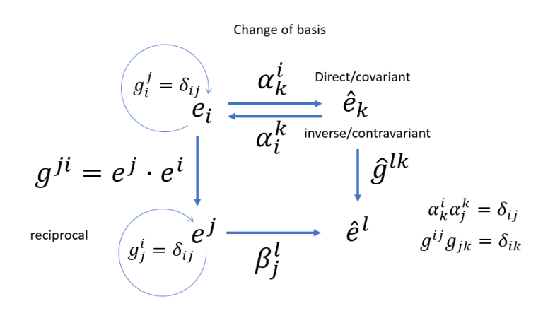
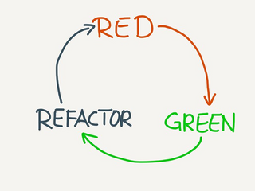

<section data-background-image="./images/intricate-explorer-HZ7VEe7Ni1s-unsplash.jpg">

### Coders should test &mdash; testers should code

&nbsp;

&nbsp;

&nbsp;

&nbsp;

&nbsp;

&nbsp;

## We all should do TDD!

by [Zeger Hendrikse](https://www.it-essence.nl/)
</section>

---

### With special thanks to ...

---

- Coding + testing are the same activity
<!-- .element: class="fragment"-->

- The importance of [test contra-variance](https://blog.cleancoder.com/uncle-bob/2017/10/03/TestContravariance.html)
<!-- .element: class="fragment"-->

- See how TDD is done _in practice_
<!-- .element: class="fragment"-->

- Motivation to learn & practice more TDD
<!-- .element: class="fragment"-->

---
### Rulez during this session

<ul>

<li>Questions are allowed at all times</li>

<li>
The goal is to illustrate <i>the TDD process</i>
  <ul>
  <li>The goal is <em>not</em> to write the best
    <ul>
    <li>Javascript ever</li>
    <li>Python ever</li>
    <li>...</li>
    </ul>
   </li>
   <li>User story is not the most realistic either</li>
</li>

---

### Contra-variance and co-variance

---

### <a href="https://blog.cleancoder.com/uncle-bob/2017/10/03/TestContravariance.html">Test Contra-variance</a>

---

### Bob Martin: [Test Contra-variance](https://www.infoq.com/news/2017/10/bob-martin-contra-variance/)

> The structure of the tests must not reflect the structure of the production code because that much coupling makes the system fragile and obstructs refactoring. Rather, the structure of the tests must be independently designed so as to minimize the coupling to the production code.

---

## Contra-variance can only be achieved using TDD

Why? ==> Next slide

---

### [Dave Farley](https://www.youtube.com/watch?v=Bq_oz7nCNUA) &#8212; the culture of TDD:

---

### We test _behaviour_ with TDD

<iframe width="100%" height="500" src="//jsfiddle.net/zhendrikse/bu7tv1kp/3/embedded/js,result/dark/" allowfullscreen="allowfullscreen" allowpaymentrequest frameborder="0"></frame>

---

### Daniel North and Chris Matts

- Test Suite => specification
- Test => scenario
- Structure tests around "[Given, When, Then](https://martinfowler.com/bliki/GivenWhenThen.html)"

---

### Summary

<ul>
  

    <li>Unit test === Functional test (!!)</li>
  

  

    <li>Unit tests test the smallest <em>functional</em> unit</li>
  

  

    <li>Practicing TDD/BDD &nbsp;==&gt;&nbsp; test contra-variance</li>
  

  

    <li>xUnit tests &#8800; TDD</li>
  

  

    <li>BDD &#8800; tools (<a href="https://cucumber.io/docs/bdd/">Cucumber</a> / <a href="https://specflow.org/">Specflow</a>)</li>
  

  

    <li>BDD = <a href="http://rspec.info/">RSpec</a>-style specifications 
     (<a href="http://jasmine.github.io/">Jasmine</a>/<a href="https://mochajs.org/">Mocha</a>/<a href="https://facebook.github.io/jest">Jest</a>/<a href="https://opensourcelibs.com/lib/specnaz">Specnaz</a>/<a href="https://github.com/nestorsalceda/mamba">Mamba</a>...)
    

  

    <li>Unit test === Functional test (!!)</li>
  

</ul>

---

### Rulez of the TDD game

<table>
  <colgroup>
    <col span="1" style="width: 60%;"/>
    <col span="1" style="width: 40%;"/>
  </colgroup>
			         
  <tbody><tr>
    <td>
      
    </td>
    <td>
      <ol>
        <li>Write a failing test</li>
        <li>Make it pass</li>
        <li>Refactor relentlessly</li>
      </ol>
    </td>
  </tr></tbody>
</table>

---

### [Martin Fowler](https://refactoring.com/): refactoring

... is a disciplined technique for restructuring an existing body of code, altering its internal structure without changing its external behavior 
---

### Rulez of the TDD game

**Small increments**, so we are [not allowed to write](http://blog.cleancoder.com/uncle-bob/2014/12/17/TheCyclesOfTDD.html):

1. any code unless it is to make a failing test pass
<!-- .element: class="fragment"-->
2. any more of a test than is sufficient to fail (also compilation!)
<!-- .element: class="fragment"-->
3. any more code than is sufficient to pass the one failing unit test
<!-- .element: class="fragment"-->

---

### Kent Beck

---
### <a href="https://en.wikipedia.org/wiki/Kent_Beck">Kent Beck's</a> [design rules](https://martinfowler.com/bliki/BeckDesignRules.html)

1. Passes the tests
2. Reveals intention ([Clean code](https://gist.github.com/wojteklu/73c6914cc446146b8b533c0988cf8d29))
3. No duplication ([DRY](https://en.wikipedia.org/wiki/Don%27t_repeat_yourself))
4. Fewest elements (<a href="http://wiki.c2.com/?DoTheSimplestThingThatCouldPossiblyWork">Simplest thing that could possibly work</a>)

---

### Who is doing what

<ul>

<li>Do you write unit test afterwards</li>

<li>Do you write unit test beforehand</li>

<li>Do you do TDD</li>

</ul>

---

### TDD is not building a bridge nor house!

---

### User story

<b>As</b> a worker in a restaurant 

<b>I want</b> to place my clean plates on a stack 

<b>so that</b> I always have plates available to serve dishes

---

#### Plans are worthless ...

### ... but planning is essential:

- Start with an empty stack
- Define pop on an empty stack
- Define push on an empty stack
- Define pop on a non-empty stack
- Define multiple pushes and pops

&nbsp;

Credits to <a href="http://barbra-coco.dyndns.org/yuri/Kent_Beck_TDD.pdf">Kent Beck</a> and <a href="https://quoteinvestigator.com/2017/11/18/planning/">Eisenhower</a>!

---

### Let's do this

- Let's do this [in Javascript](./javascript/slides.md)!
- Let's do this [in Python](./python/index.html)!
- Let's do this [in Typescript](./typescript/index.html)!
- Let's do this in Java
- Let's do this in C#
- Let's do this in C++

---

### Retrospective

<ul>

<li><a href="http://blog.cleancoder.com/uncle-bob/2014/12/17/TheCyclesOfTDD.html">Tests become more <i>specific</i>, code more <i>generic</i></a></li>

<li><a href="../ci-tbd/index.html">TBD</a> is a no-brainer</li>

<li>Difficulty is postponing "the gold"</li>

<li><a href="https://blog.cleancoder.com/uncle-bob/2017/10/03/TestContravariance.html">Contravariant test suites</a></li>

<li>1, 2, N</li>

<li>Tests grouped according to shared set-up</li>

<li>What is still left to test?</li>

</ul>

---

### It's only the beginning...

<ul>

<li><a href="https://martinfowler.com/articles/mocksArentStubs.html">Mocks, stubs, fakes, spies, ...</a></li>

<li><a href="https://khalilstemmler.com/articles/software-design-architecture/organizing-app-logic/">The Clean Architecture</a>: how to cope with dependencies on external systems</li>

<li><a href="https://blog.devgenius.io/detroit-and-london-schools-of-test-driven-development-3d2f8dca71e5">London vs Detroit schools of TDD</a></li>

<li>Developer tests his own code: <a href="../four-eyes/index.html">the nightmare of every auditor!</a></li>

</ul>

---
### Resources

- Kent Beck, [Test-Driven Development By Example](http://barbra-coco.dyndns.org/yuri/Kent_Beck_TDD.pdf) 
- [QWAN’s Little Book of Test Driven Development](tdd-booklet.pdf)
- ...
