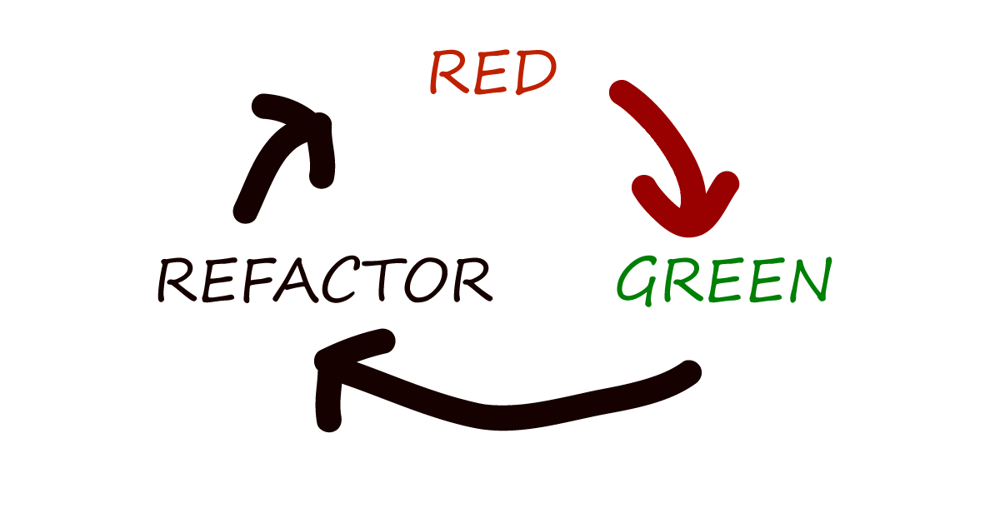

#### Coders should test

### Testers should code

## We all should do TDD!

by [Zeger Hendrikse](https://www.it-essence.nl/)

---

<ul>
<div>
<li><a href="https://blog.devgenius.io/detroit-and-london-schools-of-test-driven-development-3d2f8dca71e5">London vs Detroit schools of TDD</a></li>
</div>
<div class="fragment">
<li>See when mocks should be used <em>in practice</em></li>
</div> 
<div class="fragment">
<li>Practice TDD as a mockist</li>
</div> 
</ul>

---

### A short history of BDD

Test behaviour, not state
---

### Don't mock what you don't own

<div class="fragment">
  <h2>Use <a href="../clean-architecture/repository-adapter/slides.md">adapters</a> instead!</h2>
</div>

---

### Test doubles

<ul>
  <div class="fragment">
    <li><b>Dummy</b>: a filler, i.e. not really used</li>
  </div>
  <div class="fragment">
    <li><b>Fake</b>: fake implementation, e.g. in-mem DB</li>
  </div>
  <div class="fragment">
    <li><b>Stubs</b>: canned answers (for <i>queries</i>)</li>
  </div>
  <div class="fragment">
    <li><b>Spies</b>: objects that record call info(<i>commands</i>)</li>
  </div>
  <div class="fragment">
    <li><b>Mocks</b>: objects that verify <i>behaviour</i></li>
  </div>
</ul>

---

### Rulez of the TDD game

<table>
  <colgroup>
    <col span="1" style="width: 60%;"/>
    <col span="1" style="width: 40%;"/>
  </colgroup>
			         
  <tbody><tr>
    <td>
      
    </td>
    <td>
      <ol>
        <li>Write a failing test</li>
        <li>Make it pass</li>
        <li>Refactor relentlessly</li>
      </ol>
    </td>
  </tr></tbody>
</table>

---

### Rulez of the TDD game

**Small increments**, so we are [not allowed to write](http://blog.cleancoder.com/uncle-bob/2014/12/17/TheCyclesOfTDD.html)
<ol>
  <div class="fragment">
    <li>any code unless it is to make a failing test pass</li>
  </div>
  <div class="fragment">
    <li>any more of a test than is sufficient to fail (also compilation!)</li>
  </div>
  <div class="fragment">
    <li>any more code than is sufficient to pass the one failing unit test</li>
  </div>
</ol>
---

### Kent Beck


---
### <a href="https://en.wikipedia.org/wiki/Kent_Beck">Kent Beck's</a> [design rules](https://martinfowler.com/bliki/BeckDesignRules.html)

1. Passes the tests
2. Reveals intention ([Clean code](https://gist.github.com/wojteklu/73c6914cc446146b8b533c0988cf8d29))
3. No duplication ([DRY](https://en.wikipedia.org/wiki/Don%27t_repeat_yourself))
4. Fewest elements (<a href="http://wiki.c2.com/?DoTheSimplestThingThatCouldPossiblyWork">Simplest thing that could possibly work</a>)

---

### User story / epic

#### Audio player

<div style="font-size: 20px; border: 1px solid;" >

now ᴘʟᴀʏɪɴɢ: MyGreatSong.mp3 ───────────⚪────── ◄◄⠀▐▐⠀►► 𝟸:𝟷𝟾 / 𝟹:𝟻𝟼⠀───○ 🔊

</div>
&nbsp;

<div style="text-align: left">
<b>As</b> a music lover 

<b>I want</b> to play my favourite playlist(s)

<b>so that</b> I can use the music during my workouts
<div>

---

#### Plans are worthless ...

### ... but planning is essential:

- Start with an empty stack
- Define pop on an empty stack
- Define push on an empty stack
- Define pop on a non-empty stack
- Define multiple pushes and pops

&nbsp;

<div class="fragment">
Credits to <a href="http://barbra-coco.dyndns.org/yuri/Kent_Beck_TDD.pdf">Kent Beck</a> and <a href="https://quoteinvestigator.com/2017/11/18/planning/">Eisenhower</a>!
</div>

---

### Let's do this

<iframe frameborder="0" width="100%" height="500px" src="https://replit.com/@zwh/Audioplayer-with-TDD-Javascript-and-Jasmine?lite=false"></iframe>

---

### Player in initial state

```javascript
describe('Given a just switched on audioplayer', function () {
  it('should show the first song in the playlist on display', function() {
    audioplayer = new AudioPlayer()
    expect(
      audioplayer.getCurrentSong()).toEqual("play: MyGreatSong.mp3")
  })
})
```

----

```javascript
class AudioPlayer {
  getCurrentSong() {
    return "play: MyGreatSong.mp3"
  }
}
```
---

### Is the song playing?

```javascript
it('should have the play/pause button in state play', function(){
  audioplayer = new AudioPlayer()

  expect(
    audioplayer.getPlayPauseButtonStatus()).toEqual(PlayPauseButton.PLAY)
})
```

----

```javascript
const PlayPauseButton = {
	PLAY: "play",
	PAUSE: "pause",
}

class AudioPlayer {
  getCurrentSong() {
    return "play: MyGreatSong.mp3"
  }

  getPlayPauseButtonStatus() {
    return PlayPauseButton.PLAY
  }
}

```

---

### Red, green, ..., refactor!

```javascript
describe('Given a just switched on audioplayer', function () {
  beforeEach(function () {
    audioplayer = new AudioPlayer()
  })

  it('should show the first song in the playlist on display', function() {
    expect(
      audioplayer.getCurrentSong()).toEqual("play: MyGreatSong.mp3")   
    })

  it('should have the play/pause button in state play', function(){
    expect(audioplayer.getPlayPauseButtonStatus()).toEqual(PlayPauseButton.PLAY)
  })
})

```
---

### Previous track button

```javascript
describe('When the previous track button is pressed', function() {
  it('should do nothing', function() {
      spyOn(audioplayer, "previousTrack")
      audioplayer.previousTrack()
      expect(audioplayer.previousTrack).toHaveBeenCalled();
  })
})
```

----

```javascript

  previousTrack() {}

```

---

### Next track button

```javascript
describe('When the next track button is pressed', function () {
  it('should show the next song in the playlist on display', function () {
    audioplayer.nextTrack()
    expect(audioplayer.getCurrentSong()).toEqual("play: MyUpbeatSong.mp3")
  })
})
```

----

```javascript
class AudioPlayer {
  constructor() {
    this.currentTrack = "MyGreatSong.mp3"
  }

  getCurrentSong() {
    return "play: " + this.currentTrack
  }

  getPlayPauseButtonStatus() {
    return PlayPauseButton.PLAY
  }

  previousTrack() {}

  nextTrack() {
    this.currentTrack = "MyUpbeatSong.mp3"
  }
}
```

---

### Next track _again_

```javascript
describe('When the next track button is pressed twice', function () {
  it('should show the third song in the playlist on display', function () {
    audioplayer.nextTrack()
    audioplayer.nextTrack()
    expect(audioplayer.getCurrentSong()).toEqual("play: MyWorkoutSong.mp3")
  })
})
```

----

### Make the test pass!

```javascript
class AudioPlayer {
  constructor() {
    this.currentTrack = "MyGreatSong.mp3"
    this.songCounter = 0
  }

  // ...

  nextTrack() {
    this.songCounter++

    if (this.songCounter == 1)
      this.currentTrack = "MyUpbeatSong.mp3"
    else
      this.currentTrack = "MyWorkoutSong.mp3"
  }
}
```

---

### Refactor...

#### Playlist collaborator inevitable

Introduce mock in small increments!

```javascript
playlist = jasmine.createSpyObj('playlist', ['getCurrentTrack', 'getNextTrack'])
playlist.getCurrentTrack.and.returnValue("MyGreatSong.mp3")
playlist.getNextTrack.and.returnValues("MyUpbeatSong.mp3", "MyWorkoutSong.mp3")

audioplayer = new AudioPlayer(playlist)
```

----

### Step 1

```javascript
class AudioPlayer {
  constructor(myPlaylist) {
    this.playlist = myPlaylist
    this.currentTrack = this.playlist.getCurrentTrack()
    this.songCounter = 0
  }
```
Run unit tests ...
----

### Step 2

```javascript
  nextTrack() {
    this.songCounter++

    if (this.songCounter == 1)
      this.currentTrack = this.playlist.getNextTrack()
    else
      this.currentTrack = this.playlist.getNextTrack()
  }
```
Run unit tests ...

----

### Step 3

```javascript
  nextTrack() {
     this.currentTrack = this.playlist.getNextTrack()
  }
```
Run unit test ...

----

### Step 4

#### Grouping the double button presses

1. Promote the `playlist` to a global `var playlist` 
2. Move the `playlist.getNextTrack.and.returnValues` to the double-press tests
3. Introduce a new `beforeEach` for the double press tests

To become ... (next slide)

----

```javascript
describe('Given a next track button command', function () {
  beforeEach(function () {
    playlist.getNextTrack.and.returnValues("MyUpbeatSong.mp3", "MyWorkoutSong.mp3")
    audioplayer.nextTrack()
  })

  it('should show the next song in the playlist on display', function () {
    expect(audioplayer.getCurrentSong()).toEqual("play: MyUpbeatSong.mp3")
  })

  describe('When the next track button is pressed again', function () {
    it('should show the third song in the playlist on display', function () {
      audioplayer.nextTrack()
      expect(audioplayer.getCurrentSong()).toEqual("play: MyWorkoutSong.mp3")
    })
  })
})
```

----
### Step 5

#### Make the test(s) use the playlist too!

```javascript
it('should show the first song in the playlist on display', function () {
  expect(
    audioplayer.getCurrentSong()).toEqual("play: " + playlist.getCurrentTrack())
})
```

---

### Pressing next and then previous

```javascript
describe('When the previous buttons is pressed', function () {
  it('should show the first song in the playlist on display', function () {
    audioplayer.previousTrack()
    expect(audioplayer.getCurrentSong()).toEqual("play: MyWorkoutSong.mp3")
  })
})
```

----


### Retrospective

<ul>
<div>
<li><a href="https://martinfowler.com/articles/mocksArentStubs.html">Mocks, stubs, fakes, spies, ...</a></li>
</div>
<div class="fragment">
<li><a href="https://khalilstemmler.com/articles/software-design-architecture/organizing-app-logic/">The Clean Architecture</a>: how to cope with dependencies on external systems</li>
</div>
<div class="fragment">
<li><a href="https://blog.devgenius.io/detroit-and-london-schools-of-test-driven-development-3d2f8dca71e5">London school / Detroit schools</a></li>
</div>
<div class="fragment">
<li>Developer tests his own code: <a href="../four-eyes/index.html">the nightmare of every auditor!</a></li>
</div>
</ul>

