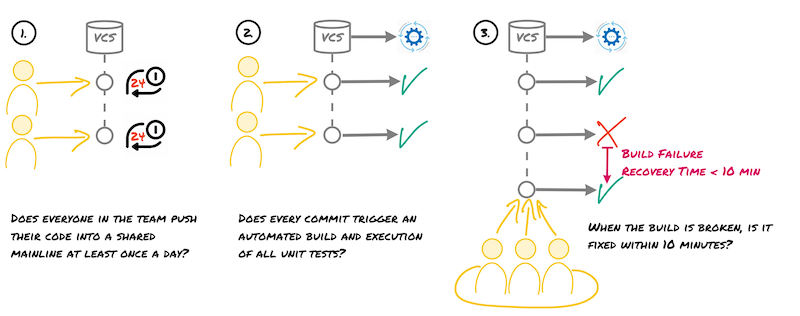
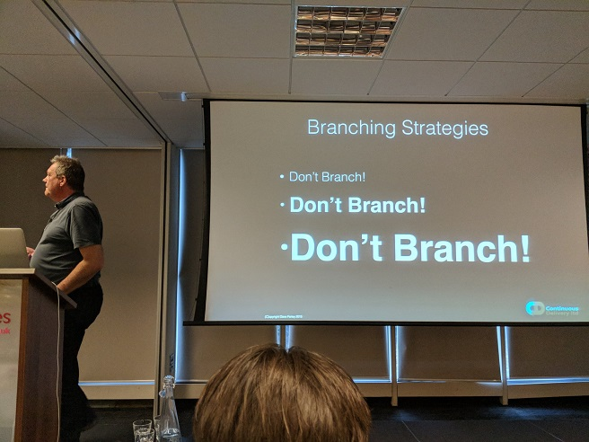
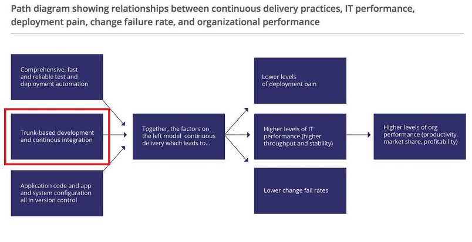
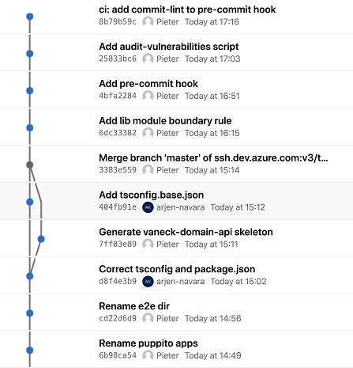

## The four-eyes principle

Zeger Hendrikse

---

#### Warming up: first question

### What does CI mean?

<!-- .element class="fragment" -->
<b>A:</b> Continuous Improvement 
<b>B:</b> Continuous Integration 
<b>C:</b> Continuous Inspection 
<b>D:</b> Continuous Insights 

<!-- .element class="fragment" -->
A: Continuous Improvement 
B: Continuous Integration 
C: Continuous Inspection 
D: Continuous Insights 

---

### The Death 

### of Continuous Integration
---

### Agenda

- <!-- .element: class="fragment"-->
  **The three ways of DevOps** (5 mins)

- <!-- .element: class="fragment"-->
  **Summary/overview CICD** (5 mins)

- <!-- .element: class="fragment"-->
  **Summary/overview TBD** (10 mins)

- <!-- .element: class="fragment"-->
  **Summary/overview Segration of Duties** (10 mins)

- <!-- .element: class="fragment"-->
  **Implementing SoD the right way** (5 mins)

- <!-- .element: class="fragment"-->
  **Code reviews?** (5 mins)

- <!-- .element: class="fragment"-->
  **Questions and answers!** (All that is left)

---

### Context: three ways of DevOps

1. <!-- .element: class="fragment"-->
   

2. <!-- .element: class="fragment"-->
   

3. <!-- .element: class="fragment"-->
   

---

#### Warming up: second question

### What does CD mean?

<!-- .element class="fragment" -->
<b>A:</b> Continuous Delivery 
<b>B:</b> Continuous Development 
<b>C:</b> Continuous Deployment 
<b>D:</b> Continuous Design 

<!-- .element class="fragment" -->
A: Continuous Delivery 
B: Continuous Development 
C: Continuous Deployment 
D: Continuous Design 

---

### CICD Overview

  
  
  
  
  

---

#### CI check: why version control

### What is the primary purpose of a VCS/Git?

<!-- .element class="fragment" -->
<b>A:</b> To facilitate roll backs and roll forwards 
<b>B:</b> To facilitate seamless branching and merging 
<b>C:</b> To facilitate communication and collaboration 
<b>D:</b> To facilitate a central back-up of source code 

<!-- .element class="fragment" -->
A: To facilitate roll backs and roll forwards 
B: To facilitate seamless branching and merging 
C: To facilitate communication and collaboration 
D: To facilitate a central back-up of source code 

---

### Do you practice Continuous Integration?

  
  
  

---

#### CI final check

### What does Continuous Integration mean in practice?

<!-- .element class="fragment" -->
<b>A:</b> Building your application and running your unit tests on a server 
<b>B:</b> Creating releasable artifacts using a CI pipeline 
<b>C:</b> Automating all aspects that are required to build your software 
<b>D:</b> Running checks locally, direct commits on trunk and subsequent automated builds 

<!-- .element class="fragment" -->
A: Building your application and running your unit tests on a server 
B: Creating releasable artifacts using a CI pipeline 
C: Automating all aspects that are required to build your software 
D: Running checks locally, direct commits on trunk and subsequent automated builds 

---

### Which branching strategy should I choose?

---

### So right off the bat ...

---

### The Big Controversy

> [...] I get “Heretic, burn him at the stake” kind of feedback [...] &mdash; [Dave Farley](https://www.davefarley.net/?p=247)

---

### The death of _continuous_ integration...

---

#### Third question: amplify feedback loops

### Which is the odd one out?

<!-- .element class="fragment" -->
<b>A:</b> Integrate early and often 
<b>B:</b> Small batch size (containing changes) 
<b>C:</b> Pair programming 
<b>D:</b> Pull requests 

<!-- .element class="fragment" -->
A: Integrate early and often 
B: Small batch size (containing changes) 
C: Pair programming 
D: Pull requests 

---

### Negative effects of branches

- <!-- .element: class="fragment"-->
  Delays integration 
  - <!-- .element: class="fragment"-->
    Slower feedback loops
  - <!-- .element: class="fragment"-->
    Kills continuous integration

- <!-- .element: class="fragment"-->
  Increased change batch size
  - <!-- .element: class="fragment"-->
    Slower feedback loops
  - <!-- .element: class="fragment"-->
    Decreased deployment frequency

- <!-- .element: class="fragment"-->
  Kills communication 
  - <!-- .element: class="fragment"-->
    Headphone/hero developers!

---

> _The trunk-based development is all about communication. We use version_
  _control to communicate what we're doing to the rest of the team. To do it_
  _regularly enough, we have to work in very small batches._ [Jez Humble](https://github.com/rht-labs/enablement-docs/issues/123)

---

### State of DevOps report

---

### Trunk Based Development (TBD)

### Rules for TBD
- **Small commits** (approx 10 - 15 lines)
- Commits (_self contained_ and _consistent_) include production and test code
- Always commit and push together
- **No** branches (except for spikes)
- Code commits are reviewed ([early and synchronously](http://allankelly.blogspot.co.uk/2015/03/code-and-other-reviews-small-piece-of.html))

---

### TBD in action

---

## The four-eyes principle

---

### Four-eyes is **NOT** equivalent to pull requests

#### Ok Zeger, I want to know more, tell me more! 
<!-- .element: class="fragment"-->

---

### The FEP is a risk control technique

---

### FEP: Segregation of Duties (SoD)

---

### FEP: Segregation of Duties (SoD)

- <!-- .element: class="fragment"-->
  Finance: mortgage requestor approves his own mortgage request 

- <!-- .element: class="fragment"-->
  IT: developer writes and tests his own code

- <!-- .element: class="fragment"-->
  [Etc.](https://simplicable.com/new/four-eyes-principle)

---

### SoD at financial institutions

No one should be able to push his code and tests single-handedly to PRD
---

---

### What usually goes wrong

- <!-- .element: class="fragment"-->
  And thus... what would the Pavlov reaction be?
  

- <!-- .element: class="fragment"-->
  The answer to life, the universe and everything:
  

---

### But really...

_Somewhere_ an independent (automated!) approval should happen:

What did ABN-AMRO choose?

---

### Automated registration of changes in Snow

- Minor and path versions are _pre_ approved
- Major versions require manual approvals (still)

---

### But I need my code reviews!

... but do you **really** do?

---

### But I need proof too!

- Eventually it boils down to trust
  - PRs are often superficially reviewed
  - TBD should involve all team members

- We may need to educate the auditors
  - No more (additional) manual steps
  - Convince of a modern way to assert SoD

---

#### Let's think
### Let's be critical
## Let's be inventive!

---
### References
- [Four-eyes principle](https://confluence.aws.abnamro.org/pages/viewpage.action?spaceKey=GRIDAD&amp;title=Four-eyes+principle)
- [Trunk Based Development](https://confluence.aws.abnamro.org/display/GRIDAD/Trunk+Based+Development)
---

# Questions

